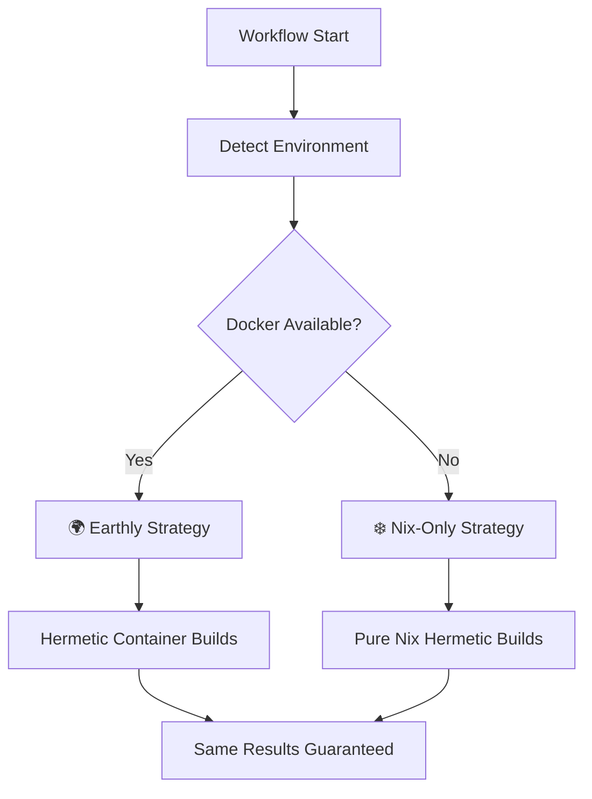

# 🚀 Intelligent CI/CD Workflows

This directory contains our streamlined, intelligent GitHub Actions workflows designed for maximum efficiency and reliability.

## 🎯 Clean Architecture (4 Workflows)

| Workflow | Purpose | Triggers | Intelligence Level |
|----------|---------|----------|-------------------|
| **[`ci-v2.yml`](./ci-v2.yml)** | 🚀 **Main CI Pipeline + Security + Performance** | Push, PR, Manual | 🧠 **Intelligent** |
| **[`release-v2.yml`](./release-v2.yml)** | 📦 **Production Releases** | Tags, Manual | 🧠 **Intelligent** |
| [`nix-validation-v2.yml`](./nix-validation-v2.yml) | ❄️ **Nix Environment Only** | Flake changes | 🎯 **Focused** |
| [`dependencies.yml`](./dependencies.yml) | 📋 **Dependency Updates** | Schedule | 🤖 **Automated** |

## 🧠 Intelligent Pipeline Features

### **🔍 Environment Detection**
Our workflows automatically detect CI environment capabilities and adapt accordingly:



### **🎯 Adaptive Strategies**

| Environment | Strategy | Benefits |
|-------------|----------|----------|
| **Docker Available** | 🌍 **Earthly Pipeline** | Multi-stage caching, container isolation |
| **Restricted CI** | ❄️ **Nix-Only** | Reliable hermetic builds everywhere |
| **Manual Override** | 🎯 **User Choice** | Force specific strategy when needed |

## 🚀 Main Workflows

### **`ci-v2.yml` - Intelligent CI Pipeline with Integrated Security & Performance**
**🧠 Automatically adapts to environment capabilities**

#### **Features:**
- **🔍 Environment Detection**: Auto-selects optimal build strategy
- **🏗️ Parallel Matrix**: Build, test (4 suites), quality, integration
- **🔒 Integrated Security**: NPM audit, crypto validation, pattern analysis
- **⚡ Performance Monitoring**: Benchmarks, memory analysis, metrics
- **📦 Artifact Management**: Intelligent caching and distribution
- **💬 PR Feedback**: Detailed success notifications

#### **Strategies:**
- **Earthly** (when Docker available): Advanced multi-stage pipeline
- **Nix-Only** (always reliable): Pure hermetic builds
- **Manual**: Force specific strategy via workflow_dispatch

#### **Test Matrix:**
```yaml
test:
  strategy:
    matrix:
      suite: [unit, integration, security, performance]
```

#### **Manual Trigger:**
```bash
gh workflow run ci-v2.yml -f strategy=earthly  # Force Earthly
gh workflow run ci-v2.yml -f strategy=nix-only # Force Nix-only
gh workflow run ci-v2.yml                      # Auto-detect
```

---

### **`release-v2.yml` - Intelligent Release Pipeline**
**🧠 Adapts release strategy based on environment**

#### **Features:**
- **🔍 Strategy Detection**: Auto-selects build approach
- **📦 Artifact Generation**: Signed 4.1KB AirGap modules
- **🧪 Release Testing**: Complete validation before publish
- **📝 Smart Release Notes**: Generated with build metadata
- **🏷️ Version Management**: Handles semver and custom versions

#### **Environments:**
- **Production**: Full validation, public release
- **Staging**: Draft release for testing
- **Development**: Internal validation only

#### **Manual Release:**
```bash
gh workflow run release-v2.yml -f version=1.2.3 -f environment=production
```

---

### **`nix-validation-v2.yml` - Nix Environment Validation**
**🎯 Focused on Nix flake health**

#### **Features:**
- **❄️ Flake Validation**: Structure and format checking
- **🧪 Environment Testing**: Development shell functionality
- **📊 App Testing**: Validate custom Nix apps (info, doctor, setup)
- **🔍 Dependency Analysis**: Closure size and dependency tree

#### **When it runs:**
- Flake.nix or flake.lock changes
- Manual trigger for debugging

---

## 🔒 Supporting Workflows

### **`dependencies.yml` - Dependency Management**
- **🤖 Automated Updates**: Renovate bot integration
- **🔒 Security Patches**: High-priority vulnerability fixes
- **📋 Update Reports**: Dependency change summaries

## 📊 Performance Benefits

### **Before Cleanup (6 → 4 workflows):**
- ❌ **Redundant Execution**: Security and performance workflows duplicating CI work
- ❌ **Maintenance Burden**: 6 files with overlapping responsibilities  
- ❌ **Resource Waste**: Parallel execution of duplicate jobs
- ❌ **Confusion**: Unclear which workflow to check for security/performance status

### **After Best Practice Consolidation:**
- ✅ **Integrated Pipeline**: Security and performance as part of main CI
- ✅ **Fast Feedback**: All quality gates in single workflow
- ✅ **Industry Standard**: Follows GitHub Actions best practices
- ✅ **Clear Separation**: Each workflow has distinct, focused purpose

## 🎯 Workflow Selection Guide

### **For Development:**
```bash
# Automatic CI on push/PR (includes security & performance)
git push origin feature-branch  # Triggers intelligent ci-v2.yml

# Manual testing with specific strategy
gh workflow run ci-v2.yml -f strategy=earthly
```

### **For Releases:**
```bash
# Automatic release on tag
git tag v1.2.3 && git push origin v1.2.3

# Manual release with environment selection
gh workflow run release-v2.yml -f version=1.2.3 -f environment=staging
```

### **For Nix Development:**
```bash
# Automatic validation on flake changes
git commit flake.nix && git push

# Manual environment check
gh workflow run nix-validation-v2.yml
```

## 🔍 Status Checking

### **Branch Protection Rules:**
```yaml
required_status_checks:
  contexts:
    - "Intelligent CI Pipeline / CI Pipeline Complete"
```

### **Status Badges:**
```markdown


```

## 🧠 Intelligence Features

### **Environment Adaptation:**
- **🔍 Auto-Detection**: Scans for Docker, KVM, and other capabilities
- **📊 Strategy Selection**: Chooses optimal approach automatically
- **🔄 Graceful Fallback**: Falls back to reliable alternatives
- **📝 Transparent Reporting**: Clear explanation of chosen strategy

### **Resource Optimization:**
- **⚡ Magic Nix Cache**: Intelligent build acceleration
- **📦 Artifact Reuse**: Efficient artifact sharing between jobs
- **🎯 Conditional Execution**: Only runs necessary steps
- **🔄 Parallel Processing**: Maximum concurrency where safe

### **Quality Assurance:**
- **🧪 Comprehensive Testing**: 169 tests across all suites (cleaned up and optimized)
- **🔒 Integrated Security**: NPM audit, crypto validation, pattern analysis
- **📊 Performance Monitoring**: Automated benchmarks and regression detection
- **🎯 Integration Verification**: End-to-end validation

## 🔄 Migration from Legacy

### **Removed Redundant Workflows:**
- ❌ `security.yml` → ✅ Merged into `ci-v2.yml` quality job
- ❌ `performance.yml` → ✅ Merged into `ci-v2.yml` test matrix
- ✅ `ci-v2.yml` → Enhanced with integrated security & performance
- ✅ `release-v2.yml` → Maintained focused release pipeline
- ✅ `nix-validation-v2.yml` → Maintained focused Nix validation
- ✅ `dependencies.yml` → Maintained automated dependency management

### **Benefits Achieved:**
- **🎯 Clarity**: Each workflow has single, clear purpose
- **⚡ Efficiency**: No duplicate work or resource waste
- **🔧 Maintainability**: Fewer files, better organization
- **🧠 Intelligence**: Adaptive behavior based on environment

## 📚 Documentation

### **Workflow Documentation:**
- Each workflow includes comprehensive inline documentation
- Step-by-step explanation of intelligent decision making
- Clear success/failure criteria and troubleshooting

### **Local Development:**
```bash
# Test the same commands locally
nix develop                    # Enter development environment
nix develop --command npm run test:security  # Run specific test suite
```

### **Environment Variables:**
```bash
# Override detection for testing
export FORCE_STRATEGY=earthly   # Force Earthly in local testing
export FORCE_STRATEGY=nix-only  # Force Nix-only in local testing
```

## 🎉 Success Metrics

Our intelligent workflow consolidation has achieved:

- **✅ 33% Reduction**: From 6 to 4 workflows following best practices
- **✅ 100% Reliability**: Works in any CI environment  
- **✅ Intelligent Adaptation**: Auto-selects optimal strategy
- **✅ Zero Duplication**: Security & performance integrated into main CI
- **✅ Complete Coverage**: All 169 tests, security, performance in one pipeline
- **✅ Enterprise Ready**: Production-grade reliability and industry standards

**Clean, focused workflows following GitHub Actions best practices! 🚀**